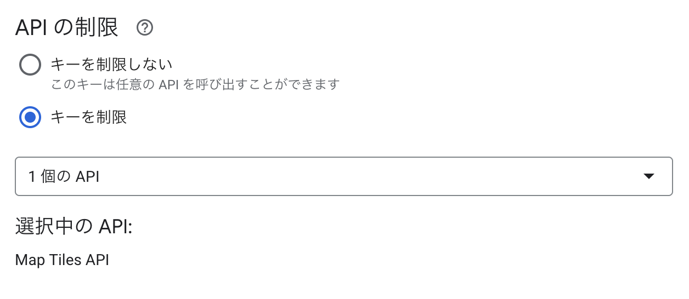

## three-geospatial Clouds 3D Tiles Renderer Integration Example

```sh
$ git clone https://github.com/takram-design-engineering/three-geospatial
$ cd three-geospatial
$ echo STORYBOOK_GOOGLE_MAP_API_KEY=xxx >> .env
$ pnpm nx storybook
```

`clouds-3d-tiles-renderer-integration--tokyo`

[http://localhost:4400/?path=/story/clouds-3d-tiles-renderer-integration--tokyo](http://localhost:4400/?path=/story/clouds-3d-tiles-renderer-integration--tokyo)



